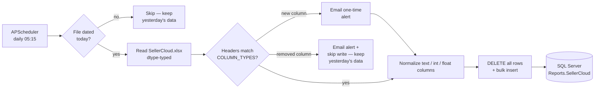

# sellercloud-sync

Daily ETL that loads the SellerCloud catalog export into SQL Server. Reads `SellerCloud.xlsx` from the configured OneDrive path, checks its headers against the known schema, normalizes column dtypes, clears the `Reports.SellerCloud` table, and bulk-inserts every row via `seller_automation_utils.database_utils.insert_dataframe`. Runs at 05:15 daily via APScheduler — ~15 minutes after the SellerCloud daily report typically lands in OneDrive.

This script was extracted from `amzn-catalog-health` in May 2026 so the daily catalog refresh runs independently of the larger nightly catalog/health scrape job. The `Reports.SellerCloud` table feeds many downstream reports across the suite; decoupling its refresh removes a hidden dependency on a long-running job that occasionally crashes early.

## Daily flow

1. **Read export** — read `SellerCloud.xlsx` from the configured OneDrive path.
2. **Schema check** — compare headers against `COLUMN_TYPES`; on drift, email a one-time alert and (for removed columns) skip the write. See [Schema-drift alerts](#schema-drift-alerts).
3. **Normalize** — normalize column dtypes for the SQL schema.
4. **Reload table** — clear the `Reports.SellerCloud` table and bulk-insert every row via `seller_automation_utils.database_utils.insert_dataframe`.

## Architecture



## Schema-drift alerts

The SellerCloud export occasionally gains or loses columns. Rather than silently
dropping new data or crashing on a vanished column, the script diffs the report's
headers against the `COLUMN_TYPES` dict on every run:

- **New column** (in the report, not in `COLUMN_TYPES`) — harmless to the load
  (the insert writes an explicit column list), so the sync continues and emails
  an alert. The email samples the column's values, infers a likely type, and
  includes ready-to-paste `COLUMN_TYPES` and `ALTER TABLE` lines plus numbered
  steps for wiring it into both the script and the SQL table.
- **Removed column** (in `COLUMN_TYPES`, not in the report) — would break the
  insert, so the script emails an alert and **skips the DB write**, leaving
  yesterday's data intact. The email gives rename/remove steps.

The read happens *before* the `DELETE`, so a drifted schema (or an unreadable
file) never clears the table and then fails to refill it.

To avoid a daily nag, alerts are deduped via `logs/schema_alert_state.json`: each
column is emailed once, and entries clear automatically once the drift is
resolved. Alerts go to `ALERT_EMAIL` (the same address as crash reports).

## Performance notes

No browser, no Excel automation — just a fast, defensive file-to-SQL load:

- **Freshness guard.** Before touching the database the script checks the
  latest file's modification date via `latest_modified_date`; if it isn't
  today's (or the folder is empty) it logs and exits cleanly — it would
  rather miss a day than overwrite `Reports.SellerCloud` with stale data that
  many downstream reports depend on.
- **One-stop column schema.** A single ordered `COLUMN_TYPES` dict maps every
  Excel column to how it's coerced and drives reading, normalization, and
  insertion. Adding a column the export starts emitting is a one-line edit.
- **Explicit dtype normalization.** Text columns are read as `str` (so
  leading-zero and long numeric IDs like UPC / SKU / eBayItemID survive without
  a `.0`); `int`/`float` columns coerce blanks to `0`; `float_null` analytical
  columns (P&L, shipping cost, FBAFee, Rebate, TotalCost) and the `datetime`
  `LastReceived` keep blanks as SQL `NULL`. Names with spaces/symbols like
  `P&L (30 days)` are bracketed for SQL automatically.
- **Injection-safe table name.** `DB_TABLE_SELLERCLOUD` is validated
  (`isalnum` after stripping underscores) before use.
- **Full-replace load.** A single `DELETE` then a bulk `insert_dataframe` of all
  41 columns in their SQL-schema order.
- **Decoupled by design.** Extracted from `amzn-catalog-health` so this daily
  refresh can't be blocked by the long-running nightly scrape.

## Logging

```text
05:15:02 INFO     Uploading SellerCloud items to database.
05:15:03 INFO     Table rows deleted successfully.
05:15:48 INFO     Data inserted successfully.
05:15:48 SUCCESS  Done!
```

Configured once via the shared helper:

```python
from seller_automation_utils.logging_utils import setup_logging
log = setup_logging("sellercloud_sync")
```

`setup_logging` wires a Rich console handler (colorized output, markup
rendering, rich tracebacks) and a 1 MB rotating file handler writing to
`logs/sellercloud_sync.log`. Available to every automation that imports
`seller_automation_utils`.

## Project layout

```
sellercloud-sync/
├── run_sellercloud_sync.py     # entry point (single script)
├── config/
│   └── paths.json.example      # OneDrive folder holding SellerCloud.xlsx
├── logs/                       # rotating run logs + schema_alert_state.json (gitignored)
├── .env.example
├── requirements.txt
├── LICENSE
└── README.md
```

## Setup

### 1. Clone and create the venv

```powershell
git clone https://github.com/dominicci13/sellercloud-sync.git
cd sellercloud-sync
py -3.12 -m venv .venv
.venv\Scripts\pip install -r requirements.txt
.venv\Scripts\pip install git+https://github.com/dominicci13/shared-python-utils.git
```

### 2. Configure

```powershell
copy .env.example .env
copy config\paths.json.example config\paths.json
```

Edit both files with real values. Both are gitignored.

### 3. Run

```powershell
.venv\Scripts\python run_sellercloud_sync.py
```

The script prompts "Run now?" — answer **Y** to execute immediately, or **N** to register the APScheduler job and idle until the next **daily 05:15** trigger.

## Environment variables

| Variable | Description |
|---|---|
| `DB_TABLE_SELLERCLOUD` | SQL Server table name (default: `SellerCloud`) |
| `ALERT_EMAIL` | Outlook account used to send crash reports (`seller_automation_utils.alert_utils.handle_crash`) and schema-drift alerts |

## Author

Built by **Brian Ramirez** ([@dominicci13](https://github.com/dominicci13)) — automation & AI workflow specialist. More on my [GitHub profile](https://github.com/dominicci13) and [LinkedIn](https://linkedin.com/in/bdramirez).

## License

[MIT](LICENSE)
